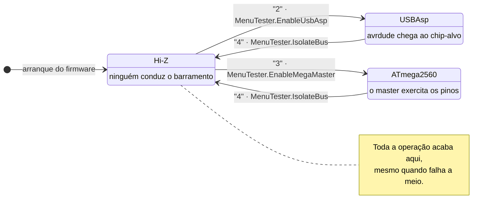
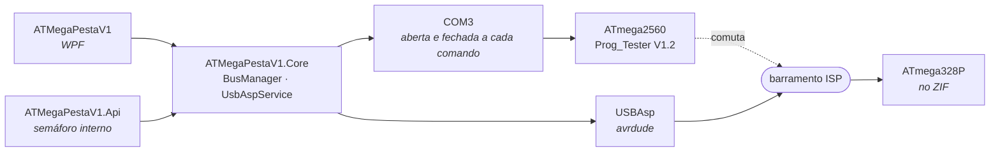
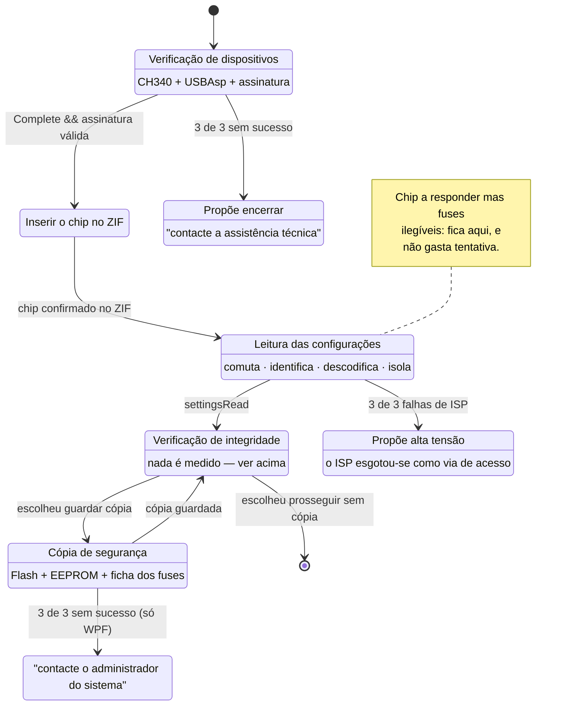

# ATMegaPesta V1

Bancada de recuperação e teste de microcontroladores AVR, para uso em laboratório de
ensino. O aluno traz um ATmega328P que deixou de responder — tipicamente com os fuses mal
gravados — e a bancada tenta chegar-lhe, ler o que lá está e guardar uma cópia antes de se
mexer em fusível nenhum.

**Esta aplicação, hoje, nunca grava fuses.** Lê-os, descodifica-os e guarda-os numa ficha
de texto junto às memórias — um registo de como o chip estava, e nada mais.

A ficha **não traz** um comando de reposição, de propósito. Uma linha
`avrdude -U lfuse:w:…` num ficheiro de texto convida a que alguém a cole à mão, e um valor
errado aí fecha o ISP de vez: o chip só volta por programação de alta tensão.

Repor os fuses passará a ser trabalho da aplicação, com os valores vindos desta mesma
leitura em vez de reescritos por alguém. **Essa parte ainda não existe** — hoje o
`UsbAspService` não tem sequer com que gravar fuses.

---

## O que é a "bancada"

**A bancada é a montagem física inteira** — não uma peça, mas o conjunto que fica em cima
da mesa do laboratório:

```
PC (Windows, com avrdude.exe)
 ├── CH340 ──────► ATmega2560 Pro Mini   ← o "master", corre o Prog_Tester V1.2
 │                        │                 e decide quem manda no barramento
 │                        ▼
 └── USBAsp ──────► barramento SPI/ISP
                          │
                          ▼
                   socket ZIF ── ATmega328P do aluno   ← o "chip-alvo"
```

O que o aluno traz é o **chip-alvo**. A bancada é tudo o resto.

Essa distinção governa os nomes por todo o lado, e vale a pena tê-la presente antes de
mexer no código:

- `DetectedDevices.Complete` significa *a bancada tem tudo o que precisa* — CH340 **e**
  USBAsp presentes.
- `BenchService` é singleton com semáforo porque **a bancada é uma só**: uma porta série,
  um USBAsp, um barramento. Dois pedidos em simultâneo deixariam o alvo ligado a dois
  mestres, e o avrdude a correr duas vezes em paralelo falha as duas.
- Nas URLs, `/api/bench/*` são operações sobre o equipamento (detectar, reiniciar) e
  `/api/target/*` são sobre o chip do aluno (ler configurações, guardar cópia).

Em inglês, no código, `bancada` é **`bench`** — em identificadores e em comentários.

### O master

O **ATmega2560 Pro Mini** corre o firmware `Prog_Tester V1.2` e faz de *BusManager*: é ele
que decide quem está ligado ao barramento ISP do chip-alvo — o USBAsp, ele próprio, ou
ninguém (Hi-Z). O PC fala com ele por um menu numérico na porta série.

| Opção | Acção | No código |
|:---:|---|---|
| `1` | Devolve a assinatura `ATmega2560_Pro_ON` | `MenuTester.Signature` |
| `2` | Põe o USBAsp no barramento | `MenuTester.EnableUsbAsp` |
| `3` | Comuta o barramento para o Mega | `MenuTester.EnableMegaMaster` |
| `4` | Isola tudo em Hi-Z | `MenuTester.IsolateBus` |
| `5` | Testa a ligação Serial2 ao Nano | `MenuTester.TestSerial2` |
| `6` | Corre a sequência de teste SPI | `MenuTester.SpiTest` |

O código-fonte do firmware está em `Prog_Tester_V1.2.txt`; os sketches do Uno e do Nano em
`Uno_Master_code/` e `Nano_slave_code/`.

**Regra que atravessa o código todo:** depois de qualquer acesso ISP, o barramento volta a
Hi-Z (opção `4`). Corre mesmo quando a operação falha a meio — não se deixa o programador
ligado ao alvo.

### Estados do barramento

Só um pode conduzir o barramento de cada vez. Dois mestres em simultâneo danificam o alvo,
e é por isso que o isolamento corre sempre em `finally`.



As transições estão anotadas com o carácter que vai para a porta série **e** com a
constante que o guarda. Assim uma renomeação aparece num `grep` e uma alteração ao firmware
obriga a tocar neste ficheiro — foi por não ter isso que o diagrama anterior deste projecto
derivou uma posição e ninguém deu por ela.

---

## Os cinco projectos

```
ATMegaPestaV1.Core     serviços da bancada, sem UI (fala com o master, o USBAsp e o WMI)
ATMegaPestaV1          aplicação WPF — a bancada em si
ATMegaPestaV1.Api      API HTTP + SignalR sobre o mesmo Core
frontend-shared        lógica dos front ends: contratos, cliente da API, o hook useBench
frontend-react         app web (browser), sobre o frontend-shared
frontend-mobile        app Android (React Native/Expo), sobre o mesmo frontend-shared
```

O ponto da divisão é não haver duas cópias da mesma coisa:

- **`Core`** é partilhado pelo WPF e pela API. Quem fala com o hardware é ele, e só ele.
- **`frontend-shared`** é partilhado pela app web e pela app Android. Tem o fluxo inteiro —
  fases, chamadas, estado, erros — e nem uma linha de DOM. As duas apps são só apresentação
  por cima disto.

**Há duas apps de front end porque o telemóvel não tem DOM.** São as duas React, mas a web
escreve `<div>` e CSS, e a nativa escreve `<View>` e `StyleSheet`. O que dava para partilhar
está partilhado.

Detalhes de cada uma: [`frontend-react/README.md`](frontend-react/README.md) e
[`frontend-mobile/README.md`](frontend-mobile/README.md).

### Quem conduz a bancada

O WPF e a API são **duas aplicações independentes sobre o mesmo hardware**. Nenhuma sabe da
outra.



O `SemaphoreSlim` do `BenchService` serializa os pedidos HTTP **entre si**. Entre as duas
aplicações não há arbitragem nenhuma — e como a porta série é aberta e fechada a cada
comando, elas não competem por ela: interleavam com sucesso.

```
WPF  → "2"  →  USBAsp no barramento     (porta fecha)
API  → "3"  →  Mega no barramento       (porta fecha)
WPF  → avrdude, a contar com o USBAsp   →  já não está lá
```

**Corra uma de cada vez.** Em produção a API serve o React na mesma porta, por isso o caso
normal é só uma aplicação de pé; o risco é em desenvolvimento, com as duas abertas.

> Isto é leitura do código, não observação com a bancada ligada. Um mutex nomeado no
> `ServiceFactory` fecharia a porta a este cenário.

---

## Passo a passo

### Passo 0 — instalar o que é preciso (uma vez)

| | Para quê | Verificar |
|---|---|---|
| **.NET 10 SDK** | WPF e API | `dotnet --version` |
| **Node 20+** | os front ends | `node --version` |
| **`avrdude.exe` no `PATH`** | falar com o chip-alvo | `avrdude -v` |

Depois, uma vez, na raiz do repositório:

```bash
npm install
```

Isto instala os três workspaces **e o Expo**. Não há mais nada a instalar no computador
para a app Android: o `expo` fica em `node_modules` e o `npm run start:mobile` chama-o de
lá. O antigo `expo-cli` global está descontinuado — não o instale.

---

### Passo a passo A — a aplicação WPF

É a aplicação de referência. Não precisa de Node nem da API.

```bash
dotnet run --project ATMegaPestaV1
```

---

### Passo a passo B — a app web

**1.** Numa consola, a API:

```bash
dotnet run --project ATMegaPestaV1.Api
```

Fica em `http://localhost:5099`. Deixe-a a correr.

**2.** Noutra consola, o Vite:

```bash
npm run dev:web
```

**3.** Abrir `http://localhost:5173`.

O Vite não serve a API — encaminha-lhe `/api` e `/hub`. Por isso são duas consolas. Se
abrir o `5173` sem a API a correr, a página carrega mas fica em erro: o `useBench` pede a
configuração e o catálogo logo no arranque.

**Em produção não são duas.** `npm run build:web` compila o React para
`ATMegaPestaV1.Api/wwwroot/`, e a partir daí é a própria API que serve a página — mesma
origem, mesma porta, sem CORS. Basta o `dotnet run`.

---

### Passo a passo C — a app Android (Expo Go)

Precisa de um telemóvel Android **na mesma rede Wi-Fi** que o computador, com a app
**Expo Go** instalada (grátis, na Play Store). Não precisa de Android Studio, nem de Java,
nem do SDK do Android: quem corre o código é o telemóvel.

> `npm run android` é outra coisa — compila e instala um APK, e para isso **precisa de
> Java e do Android SDK**. Sem eles falha. Para desenvolver, use o Expo Go.

**1. Abrir a API à rede.** Por omissão só ouve em loopback e o telemóvel não lhe chega. Em
`ATMegaPestaV1.Api/appsettings.json`:

```json
"Kestrel": { "Endpoints": { "Http": { "Url": "http://0.0.0.0:5099" } } }
```

**2. Deixar passar na firewall do Windows.** Numa consola **como administrador**:

```powershell
New-NetFirewallRule -DisplayName "ATMegaPesta API 5099" `
  -Direction Inbound -LocalPort 5099 -Protocol TCP -Action Allow -Profile Private
```

`-Profile Private` limita à rede doméstica — não abre a porta em redes públicas. Sem esta
regra o telemóvel liga-se ao Metro mas nunca à API, e a app fica em erro no ecrã de
ligação.

**3. Descobrir o IP do computador:**

```powershell
Get-NetIPAddress -AddressFamily IPv4 | Where-Object InterfaceAlias -like '*Wi*'
```

É o IPv4 da placa Wi-Fi (algo como `192.168.1.92`). Ignore endereços `172.*` de switches
virtuais do Hyper-V/WSL — o telemóvel não os alcança.

**4. Arrancar as duas coisas**, em consolas separadas:

```bash
dotnet run --project ATMegaPestaV1.Api    # consola 1
npm run start:mobile                      # consola 2 — o Metro, na porta 8081
```

**5.** Ler o código QR que a consola 2 mostra, com a **Expo Go**.

**6.** No primeiro ecrã da app, escrever o endereço da bancada — `http://192.168.1.92:5099`,
com o IP do passo 3 — e ligar. Fica guardado entre arranques.

---

### Verificações (sem hardware nem telemóvel)

```bash
dotnet build ATMegaPestaV1/ATMegaPestaV1.slnx
npm run typecheck                          # tsc nos três workspaces
npm run lint                               # eslint, com as Rules of Hooks
npm run build:web                          # o Vite compila mesmo

cd frontend-mobile && npx expo export --platform android
```

O último é o que vale a pena não esquecer: o `tsc` valida tipos, mas quem resolve módulos
em React Native é o **Metro**, com regras próprias (`metro.config.js`). Um `tsc` limpo não
prova que o Metro encontra o pacote partilhado.

---

## Configuração

`ATMegaPestaV1/appsettings.json` (WPF) e `ATMegaPestaV1.Api/appsettings.json` (API):

| Chave | O que faz |
|---|---|
| `MaxAttempts` | Tentativas de detecção dos dispositivos antes de desistir |
| `BaudRate` / `SerialTimeoutMs` | Ligação série ao master |
| `VerifySignature` | Pedir a assinatura ao equipamento (`false` para firmware antigo) |
| `BackupFolder` | *(só API)* Onde ficam as cópias. Vazio → `Documentos/ATMegaPesta/Copias` |
| `AllowedOrigins` | *(só API)* Origens autorizadas pelo CORS |

As chaves ligam-se por nome ao binder de configuração. **Renomear a propriedade em C# sem
renomear a chave aqui não dá erro nenhum** — dá silenciosamente o valor por omissão.

---

## Convenção de língua

| | Língua |
|---|---|
| Identificadores, tipos, ficheiros, pastas | Inglês |
| URLs, chaves de configuração, nomes JSON | Inglês |
| Comentários e documentação XML | Inglês |
| **Tudo o que o aluno lê no ecrã** | **Português** |
| Texto da ficha de fuses, nomes dos testes | **Português** |

O critério é: código em inglês, produto na língua de quem o usa. Uma mensagem como
`"Não detectado — Ligue o conversor USB-Serial CH340"` é conteúdo, não código.

**Uma excepção que não é estilo:** o prefixo `use` dos hooks React é API, não convenção. O
`eslint-plugin-react-hooks` identifica hooks por esse prefixo — um hook chamado
`usarBancada` fica fora das Rules of Hooks sem aviso nenhum. Daí `useBench` e `useClock`, e
daí existir um `eslint.config.mjs`.

---

## O que não está implementado

**A verificação de integridade não mede nada.** Comuta o barramento para o Mega e isola-o no
fim — isso acontece de facto — mas devolve a lista de testes toda em *pendente*.

O firmware `Prog_Tester V1.2` só expõe diagnósticos de Serial2 e de SPI. Para GPIO, I²C, ADC
e PWM não há comando nenhum, e sem medição não há resultado. Um PASS/FAIL sorteado seria
indistinguível, à bancada, de uma medição verdadeira — por isso o estado existe em vez de se
inventarem resultados. Ver `IntegrityState.NotImplemented`.

Os módulos **Programação de Alta Tensão** e **Configurações** existem no menu e mostram um
ecrã "por implementar".

---

## Fluxo, do princípio ao fim

1. **Verificação** — varre o USB à procura do CH340 e do USBAsp, e pede a assinatura ao
   master. Três tentativas; esgotadas, propõe encerrar.
2. **Inserir o chip** — o ATmega328P tem de estar no ZIF antes de o ISP ir procurá-lo.
3. **Leitura das configurações** — comuta para o USBAsp, identifica o chip, lê e descodifica
   os fuses, isola o barramento. Três falhas seguidas de ISP e propõe-se a alta tensão.
4. **Cópia de segurança** — Flash e EEPROM em Intel HEX, mais a ficha dos fuses, numa
   subpasta com o carimbo da hora.
5. **Verificação de integridade** — ver acima.

O passo 5 só destranca com a leitura do passo 3 **inteira** (chip identificado *e* fuses
descodificados): verificar pinos sem saber o estado dos fuses é medir sem saber contra quê.

### As condições e os contadores

O que interessa aqui não são as caixas, são as **condições de passagem** e o que acontece
quando as tentativas se esgotam — cada contador tem um destino diferente.



Três pormenores que o diagrama torna visíveis e o código só diz em comentários:

- **O passo seguinte abre com `settingsRead`, não com `identified`.** Um chip que responde
  ao ISP mas cujos fuses não se descodificam continua trancado — e essa falha **não gasta
  tentativa**, porque a via de acesso não está em causa.
- **Os três contadores de 3 tentativas levam a sítios diferentes:** assistência técnica,
  programação de alta tensão, administrador do sistema.
- **As retentativas da cópia existem só no WPF.** Na API a cópia é uma tentativa única —
  `BenchService` não tem o ciclo que o `FunctionalTestsView` tem. Uma divergência real entre
  os dois front ends, não uma simplificação do desenho.
